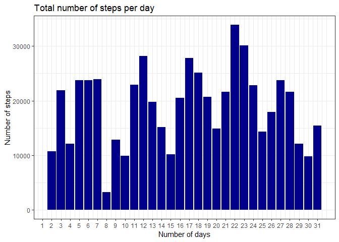
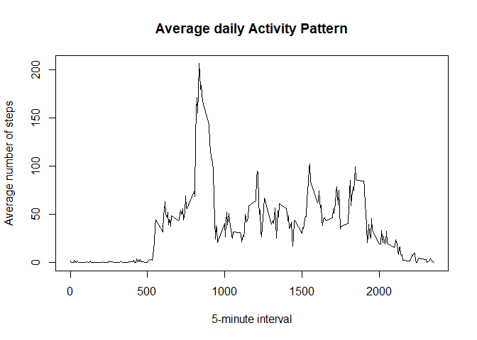
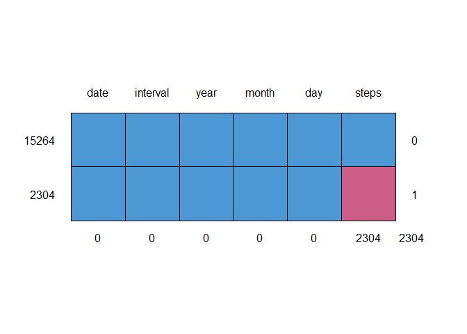
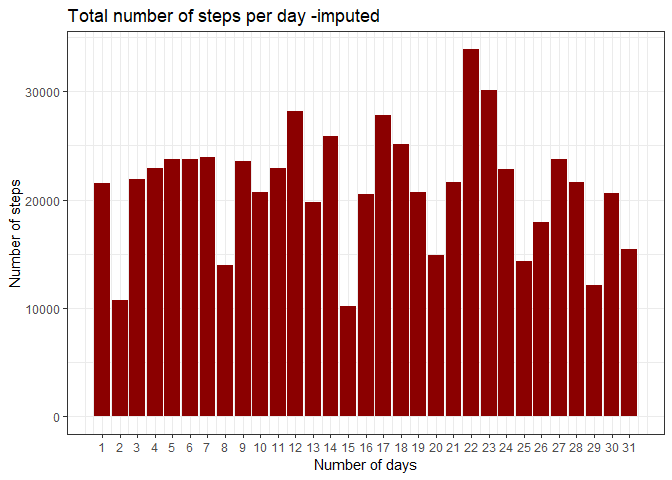
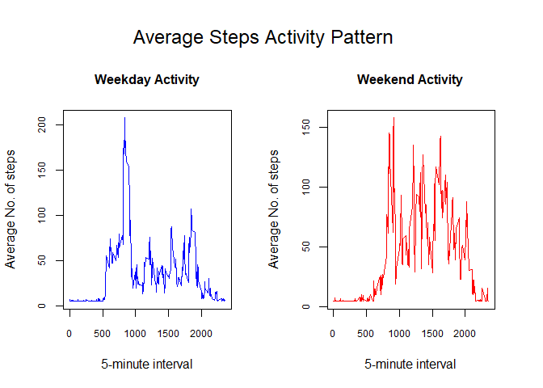

## Introduction:
It is now possible to collect a large amount of data about personal movement using activity monitoring devices such as a Fitbit, Nike Fuelband, or Jawbone Up. These type of devices are part of the quantified self movement a group of enthusiasts who take measurements about themselves regularly to improve their health, to find patterns in their behavior, or because they are tech geeks. But these data remain under-utilized both because the raw data are hard to obtain and there is a lack of statistical methods and software for processing and interpreting the data.  

This assignment makes use of data from a personal activity monitoring device. This device collects data at 5 minute intervals through out the day. The data consists of two months of data from an anonymous individual collected during the months of October and November, 2012 and include the number of steps taken in 5 minute intervals each day.

The data for this assignment can be downloaded from the course web site:  
- Dataset: [Activity monitoring data](https://d396qusza40orc.cloudfront.net/repdata%2Fdata%2Factivity.zip)

*The variables included in this dataset are:*  
- **steps**: Number of steps taking in a 5-minute interval (missing values are coded as NA.)  
- **date**: The date on which the measurement was taken in YYYY-MM-DD format.  
- **interval**: Identifier for the 5-minute interval in which measurement was taken.  

## Project Questions:
The follwoings are the questions needed to be answered within this report:
1. What is mean total number of steps taken per day?  
2. What is the average daily activity pattern?  
3. Are there differences in the activity patterns between weekdays and weekends?


## Loading and preprocessing the data
The first step is to build the connection to the data site, downloaing,  unzipping the data files and assiging the data to *data*.


```r
unzip("data.zip")
data <- read.csv("activity.csv")
```


## What is mean total number of steps taken per day?
recall libraries that will be used in this step.


```r
library(lubridate)
```

```
## 
## Attaching package: 'lubridate'
```

```
## The following object is masked from 'package:base':
## 
##     date
```

```r
library(dplyr)
```

```
## Warning: package 'dplyr' was built under R version 3.5.2
```

```
## 
## Attaching package: 'dplyr'
```

```
## The following objects are masked from 'package:lubridate':
## 
##     intersect, setdiff, union
```

```
## The following objects are masked from 'package:stats':
## 
##     filter, lag
```

```
## The following objects are masked from 'package:base':
## 
##     intersect, setdiff, setequal, union
```


#### 1. Calculate the total number of steps taken per day
In order to calculate the steps taken per day, **Lubridate** package was used to split the dates into days, month and year using *mutate*. 


```r
data <- data %>% mutate(year = year(date), month =month(date), day = day(date))
```

the number of steps made per day was calculated using *aggregate* function and the results were assigned to **steps_day**.


```r
steps_day <- aggregate(steps~day, data, sum)
```

#### 2. Make a histogram of the total number of steps taken each day
For plotting the total number of steps taken each day using a histogram, *ggplot2* package was used. usually histogrames used for plotting continous variables (sunch as days in our case). *geom_histogram* function was used for this purpose overriding **frequency** by defning **stat = "identity"**. 

note: I am not sure whether plots like [this](https://github.com/FyzHsn/Reproducible-research-project-1/blob/master/total%20step%20per%20day%20histogram-1.png) (as an example of many on this project), is the correct answer. I think these plots does not answer the question for example: what is the total step were done in the 9th day?! .  


```r
library(ggplot2)
```

```
## Warning: package 'ggplot2' was built under R version 3.5.3
```

```r
ggplot(steps_day, aes(x=day, y=steps))+
        geom_histogram(stat = "identity", fill = "darkblue")+
        scale_x_continuous(breaks = seq(1, 31, by = 1))+
        labs(title = "Total number of steps per day")+
        xlab("Number of days")+
        ylab("Number of steps")+
        theme_bw()
```

```
## Warning: Ignoring unknown parameters: binwidth, bins, pad
```

<!-- -->

#### 3. Calculate and report the mean and median of the total number of steps taken per day


```r
smean <- mean(steps_day$steps)
smedian <- median(steps_day$steps)
```

the *mean* of total number of steps per day was found to be 1.9020267\times 10^{4}, while the *median* was found to be 2.05975\times 10^{4}. 

## What is the average daily activity pattern?
#### 1. Make a time series plot (i.e. type = "l") of the 5-minute interval (x-axis) and the average number of steps taken, averaged across all days (y-axis)

in order to plot this data , first we need to calculate the average number of steps per interval


```r
steps_interval <- aggregate(steps~interval, data, mean)
```

then plot a *time series* plot, where the number of intervals on the x-axis and the average number of steps on the y-axis.


```r
plot(steps_interval$interval,steps_interval$steps, type ="l", xlab = "5-minute interval", ylab = "Average number of steps", main = "Average daily Activity Pattern")
```

<!-- -->

#### 2. Which 5-minute interval, on average across all the days in the dataset, contains the maximum number of steps?


```r
interval_max <- steps_interval[which.max(steps_interval$steps), 1] #  1 refers to the interval with the maximum average step number
```

Tha 5-minute interval with the maximum number of steps was found to be 835. 


## Imputing missing values
#### 1. Calculate and report the total number of missing values in the dataset (i.e. the total number of rows with NAs)


```r
missing <- sum(is.na(data))
missing_percent <- mean(is.na(data))*100
```

the total number of missing value in the data set was found to be 2304, which represents about 2.1857923 % of the data. 

Another way to find and visualize missing data using **mice** package.


```r
library(mice)
```

```
## Warning: package 'mice' was built under R version 3.5.3
```

```
## Loading required package: lattice
```

```
## 
## Attaching package: 'mice'
```

```
## The following objects are masked from 'package:base':
## 
##     cbind, rbind
```

```r
md.pattern(data)
```

<!-- -->

```
##       date interval year month day steps     
## 15264    1        1    1     1   1     1    0
## 2304     1        1    1     1   1     0    1
##          0        0    0     0   0  2304 2304
```

According to this table, 2304 record are missing in the steps variable.

#### 2. Devise a strategy for filling in all of the missing values in the dataset. The strategy does not need to be sophisticated. For example, you could use the mean/median for that day, or the mean for that 5-minute interval, etc.

There are a number of imputation techniques available,  here we are going to use **mean**  for missing values imputation for our dataset.


```r
data_mean <- round(mean(data$steps, na.rm = TRUE), digits = 2)
completdata_mean <- data
```


#### 3. Create a new dataset that is equal to the original dataset but with the missing data filled in.

replacing missing values with the calculated mean


```r
completdata_mean$steps[is.na(completdata_mean$steps)] <- data_mean
```

checking whether there is any missing values in the new dataset


```r
sum(is.na(completdata_mean))
```

```
## [1] 0
```

similary, we can do the same for **median** , but we are not going to do it here.

#### 4.     Make a histogram of the total number of steps taken each day and Calculate and report the mean and median total number of steps taken per day. Do these values differ from the estimates from the first part of the assignment? What is the impact of imputing missing data on the estimates of the total daily number of steps?


```r
steps_day_mean <- aggregate(steps~day, completdata_mean, sum)

ggplot(steps_day_mean, aes(x=day, y=steps))+
        geom_histogram(stat = "identity", fill = "darkred")+
        scale_x_continuous(breaks = seq(1, 31, by = 1))+
        labs(title = "Total number of steps per day -imputed")+
        xlab("Number of days")+
        ylab("Number of steps")+
        theme_bw()
```

```
## Warning: Ignoring unknown parameters: binwidth, bins, pad
```

<!-- -->


```r
smean_imputed <- mean(steps_day_mean$steps)
smedian_imputed <- median(steps_day_mean$steps)
mean_diff <- 100 - (smean/smean_imputed)*100
median_diff <- 100 - (smedian/smedian_imputed)*100
```

the mean number of steps per day for the imputed data was found to be 2.1184888\times 10^{4} compared with 1.9020267\times 10^{4}for raw data (i.e. 10.2177604 % higher). On the other hand, the median number of steps for the imputed date was found to be 2.1641\times 10^{4} compared with 2.05975\times 10^{4} for raw data (i.e only 4.8218659% difference). 

although the percentage of missing data represents `missing_percent` % of the raw data but it resulted in `mean_diff` deviation in data mean.


## Are there differences in activity patterns between weekdays and weekends?

In order to answer this question we need to creat a new data variable containg "weekday" and "weekend" as a day category.


```r
library(lubridate)
completdata_mean$date <- ymd(completdata_mean$date)
completdata_mean$weekday <- weekdays(completdata_mean$date)
completdata_mean$dayCat <- ifelse(completdata_mean$weekday %in% c("Saturday", "Sunday"), "Weekend", "Weekday")
```

Then subsetting the data into "weekday" and "weekend" datasets.


```r
weekday <- filter(completdata_mean, dayCat == "Weekday")
weekend <- filter(completdata_mean, dayCat == "Weekend")
```

then calculate number of steps per interval.


```r
steps_weekend <- aggregate(steps~interval, weekend, mean)
steps_weekday <- aggregate(steps~interval, weekday, mean)
```

and now we can creat the plots.


```r
par(mfrow = c(1, 2), oma = c(0, 0, 3, 1))
plot(steps_weekday$interval,steps_weekday$steps, type ="l", xlab = "5-minute interval", ylab = "Average No. of steps",col = "blue", main = "Weekday Activity", cex.main = 1, cex.axis = 0.75)

plot(steps_weekend$interval,steps_weekend$steps, type ="l", xlab = "5-minute interval", ylab = "Average No. of steps", col = "red", main = "Weekend Activity", cex.main = 1, cex.axis = 0.75)

mtext("Average Steps Activity Pattern", side = 3, line = 0, outer = TRUE, cex = 1.5)
```

<!-- -->

according to the figures, it is clearly that there is an increase in the nu,ber of steps during the weekends compared to normal weekdays. 


```r
wmean_weekday <- mean(steps_weekday$steps)
wmean_weekend <- mean(steps_weekend$steps)
wmedian_weekday <- median(steps_weekday$steps)
wmedian_weekend <- median(steps_weekend$steps)
wmean_diff <- 100 - (wmean_weekday/wmean_weekend)*100
wmedian_diff <- 100 - (wmedian_weekday/wmedian_weekend)*100
```

The mean number of steps during weekend was found to be 42.3660764 compared to 35.6102346during weekdays (i.e. 15.9463476 % higher).Also for the median which was 21.2268386 % higher during weekend (32.70375) compared with other weekdays (25.7617778). indecating that there is higher activity during the weekends.


